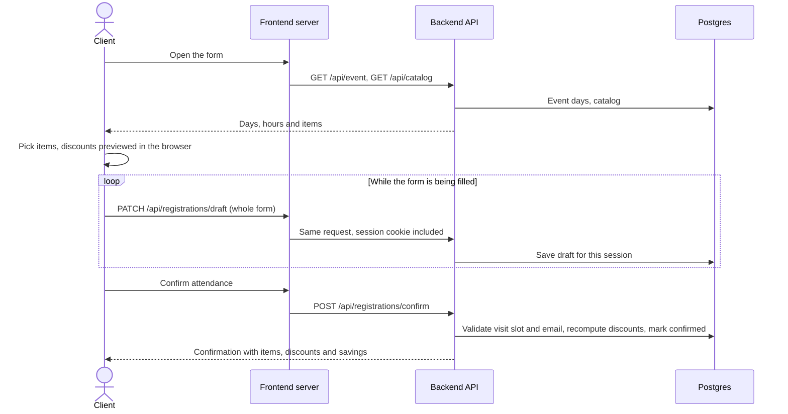

# Feria de Promociones

**Live**: https://frontend-production-396f7.up.railway.app

A web platform for an annual promotions fair. Clients confirm their attendance and
select the services and/or products they're interested in ahead of time, so a
personalized promotions portfolio can be prepared for each confirmed client.
Interest-based discounts are calculated automatically and shown to the client
before they confirm.

## Tech stack

- **Frontend**: React + TypeScript, built with Vite.
- **Backend**: Node.js + TypeScript, Express.
- **Database**: PostgreSQL.
- **Shared package**: common types and discount-calculation logic shared between
  frontend and backend.
- **Infrastructure**: Docker per service, orchestrated locally with Docker
  Compose, deployed as separate services in the cloud.

This is an npm-workspaces monorepo:

```
apps/
  frontend/   React + Vite client
  backend/    Express API
packages/
  shared/     Types and logic shared by both apps
```

## Running locally

### Prerequisites

- Node.js 20+
- npm 10+
- Docker and Docker Compose (optional, for running everything containerized)

### Install dependencies

```bash
npm install
```

### Environment variables

Copy the example env file and adjust values as needed:

```bash
cp .env.example .env
```

| Variable | Required in production | Default | Notes |
| --- | --- | --- | --- |
| `DATABASE_URL` | Yes | — | Postgres connection string. |
| `SESSION_SECRET` | Yes | `dev-secret` (non-production only) | Signs the session cookie. |
| `CORS_ORIGIN` | No | unset — no CORS headers | Only for a browser app on another origin calling the API directly. The bundled frontend is same-origin (see below). |
| `PORT` | No | `4000` (backend) / `4173` (frontend) | Railway assigns its own at runtime and takes priority. |
| `TRUST_PROXY_HOPS` | No | `1` (production only) | Number of reverse proxies in front of the backend; used to read the real client IP. |
| `ADMIN_API_KEY` | No | unset — admin routes don't mount | Enables `/api/admin` and the `/admin` view (see below). |
| `VITE_IDLE_TIMEOUT_MIN` | No | `10` | Frontend, build time. Minutes without interaction before the form asks "¿Sigues ahí?". |
| `VITE_API_URL` | No | unset — relative `/api` paths | Frontend, build time. Only if the browser must call an API on another origin; leave it empty to use the frontend's own proxy. |
| `API_PROXY_TARGET` | Yes (frontend service) | — | Backend URL the frontend server forwards `/api` and `/health` to, e.g. `http://backend.railway.internal:4000`. Read at runtime. |

The backend fails fast on startup if a variable marked "required in
production" is missing while `NODE_ENV=production` — see
`apps/backend/src/config.ts`.

### Run in development mode

In two terminals:

```bash
npm run dev:backend
npm run dev:frontend
```

The frontend dev server runs on `http://localhost:5173` and the backend on
`http://localhost:4000`. Vite forwards `/api` to the backend, so the browser
still only talks to one origin.

### Run with Docker Compose

```bash
docker compose up --build
```

This starts PostgreSQL, the backend API, and the frontend (on
`http://localhost:4173`), wired together with the environment variables in
`docker-compose.yml` and `.env`. The backend seeds the catalog
automatically on startup if the `catalog_items` table is empty, and creates a
sample event (open, three consecutive days a month out, 09:00 to 18:00) if none
exists yet — no separate seed step to run.

### Admin view

With `ADMIN_API_KEY` set, visiting `/admin` on the frontend (a trailing slash or
capital letters make no difference) asks for the key and opens the admin panel,
which has two tabs:

- **Registros**: counters for confirmed registrations, registrations per day and
  the five most requested items, then the confirmed registrations themselves —
  the input for building each client's personalized promotions portfolio. They
  can be searched by name or email, filtered by visit day and paged; selecting
  a row opens a panel with the items grouped into services and products, the
  discounts and the value with discount. Registrations whose visit no longer
  falls on a configured day are marked "Fuera de fechas". "Descargar CSV"
  exports every registration that matches the current filters. On phones the
  table turns into a list of cards. Registrations can be deleted, one at a time
  from the detail panel or all at once with "Eliminar registros fuera de fechas";
  both ask the admin to type "eliminar" first, remind them to download the CSV,
  and cannot be undone.
- **Evento**: name, location, slot length, the "Registro abierto" switch and the
  list of days with their opening and closing times, with a preview of what
  clients will see. Saving reports how many confirmed registrations fall outside
  the new dates (they are never modified), and removing a day that already has
  registrations asks for confirmation first.

If the admin session expires the panel goes back to the login with a notice.
The panel talks to the API through the same origin as the rest of the app:

- `POST /api/admin/login` `{ key }` starts an admin session (cookie),
  `POST /api/admin/logout` ends it and `GET /api/admin/me` tells whether one is
  active. Login is limited to 5 attempts per minute per IP.
- `GET /api/admin/registrations` — paginated JSON (`limit`/`offset`), filterable
  with `q` (name, surname or email, ignoring case and accents) and `day`
  (`YYYY-MM-DD`, Guatemala time).
- `GET /api/admin/registrations.csv` — the same data as CSV, with the same filters.
- `GET /api/admin/stats` — confirmations per day, the five most requested items,
  how many drafts are still open and how many confirmed registrations fall
  outside the event dates.
- `DELETE /api/admin/registrations/:id` — deletes one confirmed registration and
  its items (drafts are never deleted from here).
- `POST /api/admin/registrations/delete-out-of-window` `{ expectedCount }` — deletes
  the confirmed registrations whose visit is outside the event dates, but only if
  there are exactly `expectedCount` of them; otherwise it answers `409` and deletes
  nothing.
- `GET /api/admin/event` and `PUT /api/admin/event` — read and replace the event
  settings (see below).

Every admin route accepts either that session or, for scripts, an `x-admin-key`
header matching `ADMIN_API_KEY`.

### Event dates

The days and hours of the fair are data, not code. They live in the database
(`event_settings` and `event_days`), always in Guatemala time (UTC-6), and the
public form reads them from `GET /api/event` (only days from today onwards).

`POST /api/registrations/confirm` rejects a visit that is in the past, on a day
that is not configured, outside that day's opening hours or off the slot grid
(15, 30 or 60 minutes, counted from opening time). With registration switched
off it answers `403 { "error": "registration_closed" }`.

`PUT /api/admin/event` takes `{ name, location, slotMinutes, registrationOpen, days }`
and replaces the days. If the new dates leave already-confirmed registrations
outside them, the response reports how many in `outOfWindowCount`; those
registrations are never modified or deleted.

### Session handling

- **Anonymous session with autosave.** Every visitor gets an `httpOnly` session
  cookie (24 hours, renewed with activity) backed by Postgres. The form saves
  itself as it is filled in and is tied to that session, so closing the tab or
  refreshing brings the registration back with a "continuamos tu registro"
  notice. Each save carries the whole form, so if the session expires halfway
  through, the next save simply rebuilds the draft in a new one.
- **One origin, `SameSite=Lax`.** The browser only ever talks to the frontend's
  domain (which proxies `/api`), so the cookie is first-party and works in
  Safari and private windows. It is `secure` in production.
- **Shared devices.** At a fair the same tablet may be used by several people:
  the restore notice offers "No soy …, empezar de nuevo", the form has a
  "Borrar mis datos y empezar de nuevo" button, and after 10 minutes without
  interaction (`VITE_IDLE_TIMEOUT_MIN`) with personal data on screen a
  "¿Sigues ahí?" dialog counts down 60 seconds before clearing everything. The
  confirmation screen resets itself after 2 minutes, with the countdown visible.
  Resetting discards the browser's session and draft; confirmed registrations are
  never deleted.
- **Admin session.** `POST /api/admin/login` replaces the session id (against
  session fixation) and marks the session as admin; logging out destroys it. It
  expires after 2 hours without admin requests and the API then answers
  `401 { "error": "session_expired" }`.
- **Housekeeping.** A draft row is only created by the first autosave that
  actually contains data, so opening the form (or a bot hitting it) writes
  nothing. Unconfirmed drafts older than 7 days are deleted at startup and every
  6 hours; the `session` table cleans itself.

### How a registration flows



The admin panel follows the same path: `POST /api/admin/login` starts an admin
session and every later request reads the confirmed registrations, the stats
and the event settings from Postgres through the same proxy.

Requests the API can't process are answered in JSON, never with a stack trace:
a malformed body is `400 { "error": "invalid_json" }` and a body over 100 KB is
`413 { "error": "payload_too_large" }`, and a path under `/api` that doesn't
exist is `404 { "error": "not_found" }`. Only genuinely unexpected failures
answer `500` and are logged.

### Security headers

Both servers send them. The API (helmet) answers every response with
`X-Frame-Options: DENY`, `Content-Security-Policy: default-src 'none';
frame-ancestors 'none'`, `X-Content-Type-Options: nosniff` and
`Referrer-Policy: no-referrer`, plus `Strict-Transport-Security` in production
only. The frontend server adds `X-Frame-Options: DENY`,
`Referrer-Policy: same-origin` and a Content-Security-Policy that only allows
the app's own origin (scripts, self-hosted fonts, `fetch` calls and
`data:` images; inline styles are allowed because React sets style attributes)
to everything it serves itself — the page, `/admin` and the assets. Proxied
`/api` responses keep the API's own headers. Anything that loads a script,
font or image from another host needs the policy in
`apps/frontend/server.mjs` widened first.

### Architecture decisions

**Monorepo with a shared package.** `packages/shared` holds the discount rules
and the request/response types for both apps. The frontend runs the exact
same discount function for its live preview that the backend runs as the
source of truth at confirm time — one implementation, so the two can't drift
apart on what "5% off" means.

**Discounts are recalculated server-side on confirm.** The frontend's preview
is just that: a preview. `POST /api/registrations/confirm` re-reads current
catalog prices and recomputes both discounts from the registration's actual
selected items, ignoring anything the client might have sent. A client can't
confirm with a discount it didn't actually earn.

**One origin for the browser.** The frontend container serves the built app
and forwards `/api` and `/health` to the backend (`apps/frontend/server.mjs`,
locally the Vite dev server does the same). Everything the browser loads comes
from a single origin, so the session cookie is first-party (`SameSite=Lax`,
`Secure`, `HttpOnly`) and no CORS setup is needed. This matters because
`*.up.railway.app` is on the Public Suffix List: two Railway services on
separate subdomains are cross-site, and a `SameSite=None` cookie between them
is treated as third-party and blocked by Safari and by private windows.

**Money as integer cents.** Prices and totals are stored and computed in
integer cents end-to-end, only formatted to `Q123.45` at the UI edge. This
avoids the rounding drift that floating-point currency math is prone to,
particularly when applying a percentage discount.

### Deploying to Railway

The project has three services: the managed Postgres plugin, `backend` and
`frontend`, each built from its own Dockerfile (`apps/backend/Dockerfile`,
`apps/frontend/Dockerfile`, with the repo root as the build context).

1. **backend**: set `DATABASE_URL` (reference the Postgres plugin),
   `SESSION_SECRET`, `NODE_ENV=production`, `PORT=4000` and, optionally,
   `ADMIN_API_KEY`. It does not need a public domain: the frontend reaches it
   over Railway's private network.
2. **frontend**: set `PORT=4173` and `API_PROXY_TARGET` to the backend's private
   address, e.g. `http://backend.railway.internal:4000`. Only this service needs
   a public domain.
3. The frontend forwards the client's `X-Forwarded-For`/`X-Forwarded-Proto`
   headers unchanged, so the backend's default `TRUST_PROXY_HOPS=1` is right.
   Raise it only if another proxy is added in front of the frontend.

### Next steps

The catalog of services and products is seeded on first start and changed
directly in the database. Managing it from the admin panel (create, edit and
deactivate items) is the natural next step, as are confirmation emails.

### Other commands

```bash
npm run lint       # lint all workspaces
npm run typecheck  # type-check all workspaces
npm run build      # build all workspaces
npm run test       # run tests in all workspaces
```
