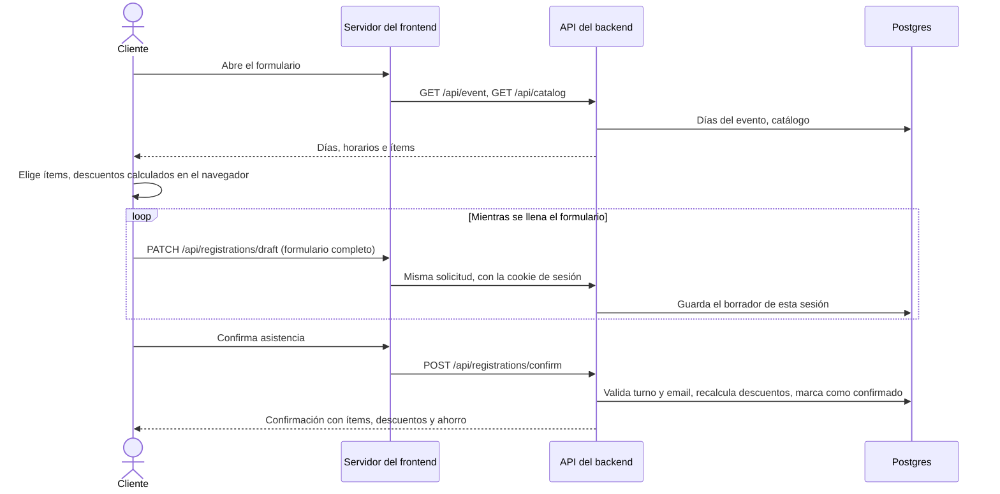
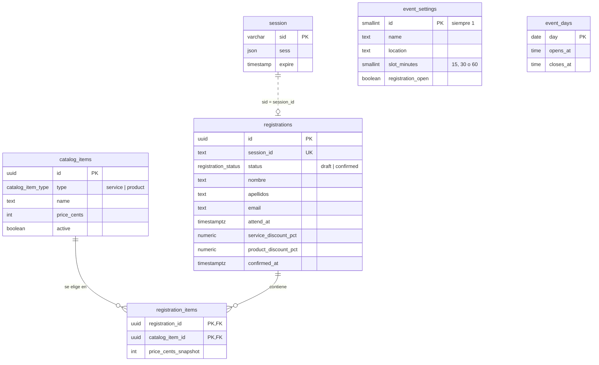

# Feria de Promociones

**En línea**: https://feria-de-promociones.up.railway.app

Plataforma web para la feria anual de promociones. Los clientes confirman su
asistencia y eligen de antemano los servicios y/o productos que les interesan,
de modo que se pueda preparar un portafolio de promociones personalizado para
cada cliente confirmado. Los descuentos según el interés se calculan
automáticamente y se muestran al cliente antes de confirmar.

## Reglas de descuento

| Categoría | Condición | Descuento |
| --- | --- | --- |
| Servicios | 2 o más servicios | 3 % |
| Servicios | 2 o más servicios y suma mayor a Q1,500 | 5 % |
| Productos | 3 o más productos | 3 % |
| Productos | 5 o más productos | 5 % |

Cada categoría se calcula por separado, y el descuento de servicios y el de
productos se muestran uno junto al otro. Los dos porcentajes de servicios no se
suman: cuando se cumple la condición del 5 %, ese reemplaza al 3 %. "Mayor a
Q1,500" es estricto: dos servicios que suman exactamente Q1,500.00 obtienen 3 %,
y con Q1,500.01 pasan a 5 %.

El cálculo vive en `packages/shared/src/discounts.ts`. Lo usan tanto la vista
previa del formulario como la confirmación en el backend, y
`packages/shared/src/discounts.test.ts` cubre cada borde.

## Tecnologías

- **Frontend**: React + TypeScript, compilado con Vite.
- **Backend**: Node.js + TypeScript, Express.
- **Base de datos**: PostgreSQL.
- **Paquete compartido**: tipos y lógica de cálculo de descuentos comunes al
  frontend y al backend.
- **Infraestructura**: un Docker por servicio, orquestados en local con Docker
  Compose y desplegados como servicios separados en la nube.

Es un monorepo con npm workspaces:

```
apps/
  frontend/   Cliente React + Vite
  backend/    API con Express
packages/
  shared/     Tipos y lógica compartidos por ambas apps
```

## Ejecución en local

### Requisitos

- Node.js 20+
- npm 10+
- Docker y Docker Compose (opcional, para ejecutar todo en contenedores)

### Instalar dependencias

```bash
npm install
```

### Variables de entorno

Copia el archivo de ejemplo y ajusta los valores según haga falta:

```bash
cp .env.example .env
```

| Variable | Obligatoria en producción | Valor por defecto | Notas |
| --- | --- | --- | --- |
| `DATABASE_URL` | Sí | — | Cadena de conexión a Postgres. |
| `SESSION_SECRET` | Sí | `dev-secret` (solo fuera de producción) | Firma la cookie de sesión. |
| `CORS_ORIGIN` | No | sin definir — no se envían cabeceras CORS | Solo para una app de navegador en otro origen que llame directamente a la API. El frontend incluido es del mismo origen (ver más abajo). |
| `PORT` | No | `4000` (backend) / `4173` (frontend) | Railway asigna el suyo en tiempo de ejecución y tiene prioridad. |
| `TRUST_PROXY_HOPS` | No | `1` (solo en producción) | Número de proxies inversos delante del backend; sirve para leer la IP real del cliente. |
| `ADMIN_API_KEY` | No | sin definir — las rutas de administración no se montan | Habilita `/api/admin` y la vista `/admin` (ver más abajo). |
| `VITE_IDLE_TIMEOUT_MIN` | No | `10` | Frontend, en tiempo de compilación. Minutos de inactividad antes de que el formulario pregunte "¿Sigues ahí?". |
| `VITE_API_URL` | No | sin definir — rutas relativas `/api` | Frontend, en tiempo de compilación. Solo si el navegador debe llamar a una API en otro origen; déjala vacía para usar el proxy del propio frontend. |
| `API_PROXY_TARGET` | Sí (servicio frontend) | — | URL del backend a la que el servidor del frontend reenvía `/api` y `/health`, por ejemplo `http://backend.railway.internal:4000`. Se lee en tiempo de ejecución. |

El backend falla al arrancar si falta una variable marcada como "obligatoria en
producción" mientras `NODE_ENV=production`; ver `apps/backend/src/config.ts`.

### Ejecutar en modo desarrollo

En dos terminales:

```bash
npm run dev:backend
npm run dev:frontend
```

El servidor de desarrollo del frontend corre en `http://localhost:5173` y el
backend en `http://localhost:4000`. Vite reenvía `/api` al backend, así que el
navegador sigue hablando con un solo origen.

### Ejecutar con Docker Compose

```bash
docker compose up --build
```

Esto levanta PostgreSQL, la API del backend y el frontend (en
`http://localhost:4173`), conectados mediante las variables de entorno de
`docker-compose.yml` y `.env`. Al arrancar, el backend carga el catálogo
automáticamente si la tabla `catalog_items` está vacía, y crea un evento de
ejemplo (abierto, tres días seguidos dentro de un mes, de 09:00 a 18:00) si
todavía no existe ninguno; no hay que ejecutar ningún paso de carga aparte.

### Otros comandos

```bash
npm run lint       # revisa el código de todos los workspaces
npm run typecheck  # revisa los tipos de todos los workspaces
npm run build      # compila todos los workspaces
npm run test       # ejecuta las pruebas de todos los workspaces
```

## Funcionalidades

### Vista de administración

Con `ADMIN_API_KEY` definida, al visitar `/admin` en el frontend (da igual una
barra final o las mayúsculas) se pide la clave y se abre el panel de
administración, que tiene dos pestañas:

- **Registros**: contadores de registros confirmados, registros por día y los
  cinco ítems más solicitados, y a continuación los registros confirmados; con
  ellos se arma el portafolio de promociones personalizado de cada cliente.
  Se pueden buscar por nombre o email, filtrar por día de visita y paginar;
  al seleccionar una fila se abre un panel con los ítems agrupados en servicios
  y productos, los descuentos y el valor con descuento. Los registros cuya
  visita ya no cae en un día configurado se marcan como "Fuera de fechas".
  "Descargar CSV" exporta todos los registros que coinciden con los filtros
  actuales. En teléfonos la tabla se convierte en una lista de tarjetas. Los
  registros se pueden eliminar, uno a uno desde el panel de detalle o todos a
  la vez con "Eliminar registros fuera de fechas"; ambas acciones piden al
  administrador escribir "eliminar", le recuerdan descargar el CSV y no se
  pueden deshacer.
- **Evento**: nombre, lugar, duración de los turnos, el interruptor "Registro
  abierto" y la lista de días con su hora de apertura y cierre, con una vista
  previa de lo que verán los clientes. Al guardar se informa cuántos registros
  confirmados quedan fuera de las nuevas fechas (nunca se modifican), y quitar
  un día que ya tiene registros pide confirmación antes.

Si la sesión de administración expira, el panel vuelve al inicio de sesión con
un aviso. El panel sigue el mismo camino que el resto de la app: `POST
/api/admin/login` inicia una sesión de administración y cada solicitud posterior
lee de Postgres los registros confirmados, las estadísticas y la configuración
del evento a través del mismo proxy (rutas en la sección API).

### Fechas del evento

Los días y horarios de la feria son datos, no código. Viven en la base de datos
(`event_settings` y `event_days`), siempre en hora de Guatemala (UTC-6), y el
formulario público los lee de `GET /api/event` (solo los días de hoy en
adelante).

`POST /api/registrations/confirm` rechaza una visita en el pasado, en un día
que no está configurado, fuera del horario de apertura de ese día o fuera de la
cuadrícula de turnos (15, 30 o 60 minutos, contados desde la hora de apertura).
Con el registro desactivado responde `403 { "error": "registration_closed" }`.

`PUT /api/admin/event` recibe `{ name, location, slotMinutes, registrationOpen, days }`
y reemplaza los días. Si las nuevas fechas dejan registros ya confirmados fuera
de ellas, la respuesta indica cuántos en `outOfWindowCount`; esos registros
nunca se modifican ni se eliminan.

### Manejo de sesiones

- **Sesión anónima con autoguardado.** Un visitante recibe una cookie de sesión
  `httpOnly` (24 horas, renovada con la actividad) respaldada por Postgres la
  primera vez que se guarda algo (ver Mantenimiento). El formulario se guarda
  solo mientras se llena y queda ligado a esa sesión, así que cerrar la pestaña
  o recargar devuelve el registro con el aviso "continuamos tu registro". Cada
  guardado lleva el formulario completo, de modo que si la sesión expira a
  medias, el siguiente guardado reconstruye el borrador en una sesión nueva.
- **Un solo origen, `SameSite=Lax`.** El navegador solo habla con el dominio del
  frontend (que hace de proxy de `/api`), por lo que la cookie es propia del
  sitio y funciona en Safari y en ventanas privadas. En producción es `secure`.
- **Dispositivos compartidos.** En una feria una misma tableta puede usarla
  varias personas: el aviso de restauración ofrece "No soy …, empezar de
  nuevo", el formulario tiene un botón "Borrar mis datos y empezar de nuevo", y
  tras 10 minutos sin interacción (`VITE_IDLE_TIMEOUT_MIN`) con datos personales
  en pantalla, un diálogo "¿Sigues ahí?" cuenta 60 segundos antes de borrar todo.
  La pantalla de confirmación se reinicia sola a los 2 minutos, con la cuenta
  regresiva visible. Reiniciar descarta la sesión y el borrador del navegador;
  los registros confirmados nunca se eliminan.
- **Sesión de administración.** `POST /api/admin/login` reemplaza el id de
  sesión (contra la fijación de sesión) y marca la sesión como administrador;
  cerrar sesión la destruye. Expira tras 2 horas sin solicitudes de
  administración y la API responde entonces
  `401 { "error": "session_expired" }`.
- **Mantenimiento.** Una fila de borrador solo se crea con el primer
  autoguardado que realmente contiene datos (o con una confirmación), y en ese
  mismo momento se guarda la sesión y se envía su cookie, porque el borrador se
  identifica por el id de sesión. Abrir el formulario, o un bot que consulte la
  API, no escribe nada: ni borrador, ni fila de sesión, ni cookie. Como un
  visitante que no ha guardado nada no tiene un id de sesión estable, el límite
  de solicitudes por sesión solo se aplica cuando ya tiene uno; el límite por IP
  cubre a todos. Los borradores sin confirmar de más de 7 días se eliminan al
  arrancar y cada 6 horas; la tabla `session` se limpia sola.

## Flujo de un registro



**Un registro confirmado por email.** Confirmar con un email que ya tiene un
registro confirmado se rechaza con `400` y el mensaje "Este email ya tiene una
asistencia confirmada." (un error de campo en `email`). La comparación ignora
mayúsculas y espacios alrededor, de modo que `ANA@Example.com` es la misma
dirección que `ana@example.com`. La regla evita que la feria termine con
registros duplicados de una misma persona, y dos confirmaciones simultáneas
para un mismo email se serializan para que solo una pase. Tiene un costo
conocido: no hay forma de editar un registro confirmado, así que quien eligió
mal el horario no puede volver a confirmar con el mismo email (ver próximos
pasos).

## Modelo de datos



Las tablas salen de las migraciones en `apps/backend/migrations/`; `session` la
crea `connect-pg-simple` al arrancar. Solo se muestran las columnas necesarias
para entender el diseño.

PostgreSQL encaja bien porque el dominio es relacional (registros, ítems y
catálogo) y porque confirmar necesita transacciones y bloqueos: la regla de un
registro confirmado por email se serializa con un bloqueo consultivo dentro de
la transacción de confirmación. Cada fila de `registration_items` guarda el
precio del momento (`price_cents_snapshot`), así que un cambio posterior en el
catálogo no altera confirmaciones pasadas. El borrador es la misma fila de
`registrations` con `status = 'draft'`, ligada al id de la sesión mediante
`session_id`; al confirmar solo cambia su estado. Por último, el evento es
configuración en la base de datos (`event_settings` y `event_days`) y no código:
el administrador cambia las fechas desde el panel sin volver a desplegar.

## API

### Rutas de administración

Todas cuelgan de `/api/admin`:

- `POST /api/admin/login` `{ key }` inicia una sesión de administración
  (cookie), `POST /api/admin/logout` la cierra y `GET /api/admin/me` indica si
  hay una activa. El inicio de sesión está limitado a 5 intentos por minuto por
  IP.
- `GET /api/admin/registrations`: JSON paginado (`limit`/`offset`), filtrable
  con `q` (nombre, apellidos o email, sin distinguir mayúsculas ni acentos) y
  `day` (`YYYY-MM-DD`, hora de Guatemala).
- `GET /api/admin/registrations.csv`: los mismos datos en CSV, con los mismos
  filtros.
- `GET /api/admin/stats`: confirmaciones por día, los cinco ítems más
  solicitados, cuántos borradores siguen abiertos y cuántos registros
  confirmados quedan fuera de las fechas del evento.
- `DELETE /api/admin/registrations/:id`: elimina un registro confirmado y sus
  ítems (los borradores nunca se eliminan desde aquí).
- `POST /api/admin/registrations/delete-out-of-window` `{ expectedCount }`:
  elimina los registros confirmados cuya visita queda fuera de las fechas del
  evento, pero solo si hay exactamente `expectedCount`; de lo contrario responde
  `409` y no elimina nada.
- `GET /api/admin/event` y `PUT /api/admin/event`: leen y reemplazan la
  configuración del evento (ver Fechas del evento).

Todas las rutas de administración aceptan esa sesión o, para scripts, una
cabecera `x-admin-key` igual a `ADMIN_API_KEY`.

### Manejo de errores

Las solicitudes que la API no puede procesar se responden en JSON, nunca con un
stack trace: un cuerpo mal formado es `400 { "error": "invalid_json" }`, un
cuerpo de más de 100 KB es `413 { "error": "payload_too_large" }` y una ruta
bajo `/api` que no existe es `404 { "error": "not_found" }`. Solo los fallos
realmente inesperados responden `500` y se registran en el log.

### Límites de solicitudes

Los límites son por minuto y responden
`429 { "error": "rate_limited" }` con un mensaje en español. Toda ruta bajo
`/api` está limitada a 1200 solicitudes por IP, y `/health` y `/health/ready`
nunca se limitan. Además, `/api/registrations` conserva sus propios límites
(120 por sesión y 600 por IP) y `POST /api/admin/login` permite 5 intentos por
IP. Las cifras son generosas a propósito: en la feria muchas personas comparten
el WiFi del lugar y, por lo tanto, una misma dirección IP.

### Cabeceras de seguridad

Ambos servidores las envían. La API (helmet) responde todo con
`X-Frame-Options: DENY`, `Content-Security-Policy: default-src 'none';
frame-ancestors 'none'`, `X-Content-Type-Options: nosniff` y
`Referrer-Policy: no-referrer`, más `Strict-Transport-Security` solo en
producción. El servidor del frontend añade `X-Frame-Options: DENY`,
`Referrer-Policy: same-origin` y una Content-Security-Policy que solo permite el
origen propio de la app (scripts, fuentes autoalojadas, llamadas `fetch` e
imágenes `data:`; se permiten estilos en línea porque React escribe atributos
`style`) a todo lo que sirve él mismo: la página, `/admin` y los recursos. Las
respuestas de `/api` reenviadas por el proxy conservan las cabeceras de la API.
Cualquier cosa que cargue un script, una fuente o una imagen desde otro host
requiere ampliar antes la política en `apps/frontend/server.mjs`.

## Decisiones de arquitectura

**Monorepo con un paquete compartido.** `packages/shared` contiene las reglas
de descuento y los tipos de solicitud/respuesta de ambas apps. El frontend
ejecuta, para su vista previa en vivo, exactamente la misma función de
descuento que el backend usa como fuente de verdad al confirmar: una sola
implementación, así que no pueden discrepar sobre qué significa "5 % de
descuento".

**Los descuentos se recalculan en el servidor al confirmar.** La vista previa
del frontend es solo eso: una vista previa. `POST /api/registrations/confirm`
vuelve a leer los precios vigentes del catálogo y recalcula ambos descuentos a
partir de los ítems realmente seleccionados en el registro, ignorando cualquier
cosa que envíe el cliente. Un cliente no puede confirmar con un descuento que no
le corresponde.

**Un solo origen para el navegador.** El contenedor del frontend sirve la app
compilada y reenvía `/api` y `/health` al backend (`apps/frontend/server.mjs`;
en local lo hace el servidor de desarrollo de Vite). Todo lo que carga el
navegador viene de un único origen, así que la cookie de sesión es propia del
sitio (`SameSite=Lax`, `Secure`, `HttpOnly`) y no hace falta configurar CORS.
Esto importa porque `*.up.railway.app` está en la Public Suffix List: dos
servicios de Railway en subdominios distintos son de sitios distintos, y una
cookie `SameSite=None` entre ellos se trata como de terceros y la bloquean
Safari y las ventanas privadas.

**Dinero en centavos enteros.** Los precios y totales se guardan y calculan en
centavos enteros de principio a fin, y solo se formatean como `Q123.45` en el
borde de la interfaz. Así se evita la deriva de redondeo propia de la aritmética
de moneda con punto flotante, en particular al aplicar un descuento porcentual.

## Despliegue en Railway

El proyecto tiene tres servicios: el plugin gestionado de Postgres, `backend` y
`frontend`, cada uno construido desde su propio Dockerfile
(`apps/backend/Dockerfile`, `apps/frontend/Dockerfile`, con la raíz del
repositorio como contexto de construcción).

1. **backend**: define `DATABASE_URL` (referencia al plugin de Postgres),
   `SESSION_SECRET`, `NODE_ENV=production`, `PORT=4000` y, opcionalmente,
   `ADMIN_API_KEY`. No necesita dominio público: el frontend lo alcanza por la
   red privada de Railway.
2. **frontend**: define `PORT=4173` y `API_PROXY_TARGET` con la dirección
   privada del backend, por ejemplo `http://backend.railway.internal:4000`. Solo
   este servicio necesita un dominio público.
3. El frontend reenvía sin cambios las cabeceras `X-Forwarded-For` y
   `X-Forwarded-Proto` del cliente, así que el valor por defecto
   `TRUST_PROXY_HOPS=1` del backend es el correcto. Auméntalo solo si se añade
   otro proxy delante del frontend.

## Próximos pasos

El catálogo de servicios y productos se carga en el primer arranque y se cambia
directamente en la base de datos. Gestionarlo desde el panel de administración
(crear, editar y desactivar ítems) es el siguiente paso natural, al igual que
los correos de confirmación. Permitir que un cliente modifique o cancele su
registro confirmado (por ejemplo, para elegir otro turno) es otro, ya que la
regla de un registro por email hoy no le deja forma de corregir un error.
